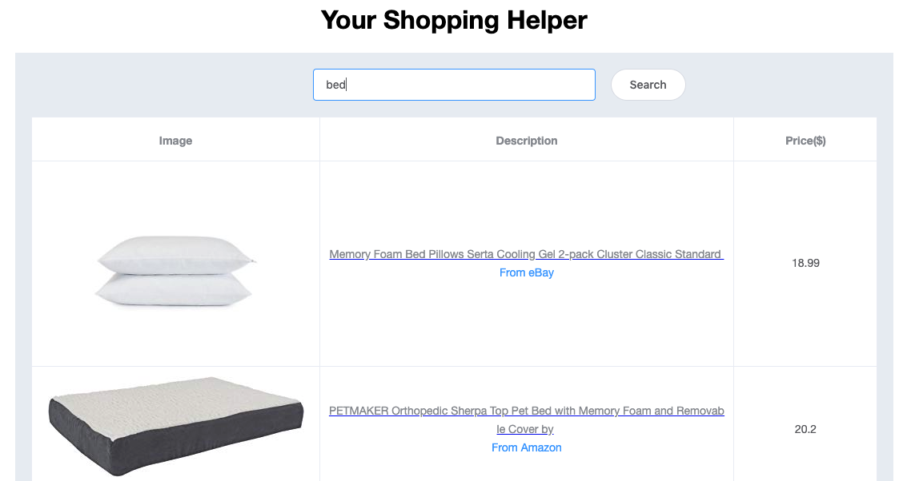
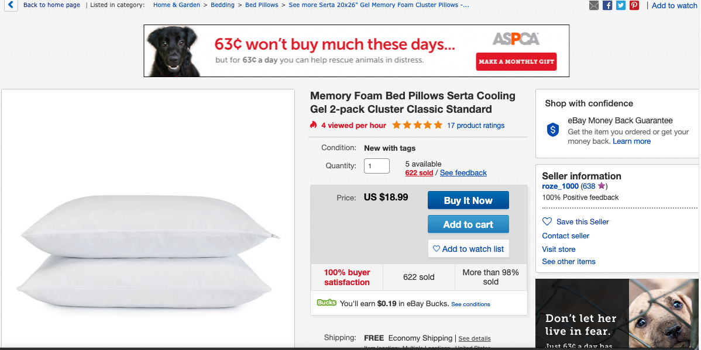

# Final Project Report

* Name: Wei Huo
* Section: 666
* Email: whuo1@jhu.edu

## Summary
This project is a meta-crawler specified in Option 4b: MetaShopper. It provides a search engine to acquire the information of merchandise which is ranked by price. Right now it only supports searching from Ebay and Amazon, but it is straightforward to extend to other shopping sites.

## Installation
1. Create a Python3 virtual environment in the folder and activate.
```
$ python3 -m venv venv
$ source venv/bin/activate
```
2. Install dependiencies from requirements.txt.
```
(venv)$ pip install -r requirements.txt
```
3. Run the app.
```
(venv)$ python app.py
```
4. Visit [http://127.0.0.1:5000/]( http://127.0.0.1:5000/) in the browser.
5. Ready for search.

## Achievements
1. An user-friendly UI to help searching for the cheapest goods from Amazon and Ebay.
2. A crawler is implemented to extract desired information including images, names, links and prices, from the corresponding html files.
3. The results are ranked by their prices.
4. Can be adapted to support other shopping sites in a straightforward way.

## Limitation
1. It could only support Amazon and Ebay, which limits it's use in the real life.
2. The alignment in the html files is changing constantly such that a working extraction protocol right now won't be valid in the future.
3. Not all the shopping sites provide their information in a standard html file. Instead, they generate the information dynamically using javascript, which makes it really difficult to do the information extraction.
4. The searching result could better be ranked by other rules including like rate, relevance, etc.

## Sample outputs


